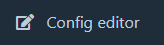
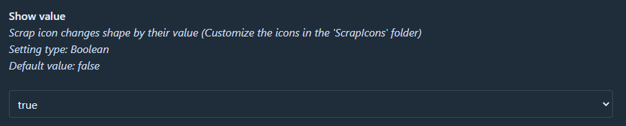
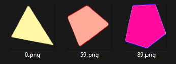

## Overview

- Scrap icons change shape depending on their value
- Monitor compass can now be centered to the player, and optionally measure the player's distance to the ship
- *Monitor compass works inside buildings* **(WIP)**

## Usage Guide

### Enabling Tweaks

1. Install [BetterMonitor](https://thunderstore.io/c/lethal-company/p/fumiko/BetterMonitor/) to a profile
2. Open the config editor 
3. Find `BepInEx\config\BetterMonitor.cfg`
4. Enable desired tweaks  

5. Save and close the config editor
6. Start the game, and you should see the tweaks in effect

### Scrap Icons

1. Go to `%AppData%\r2modmanPlus-local\LethalCompany\profiles\<PROFILE NAME>\BepInEx\plugins`
2. Open the `ScrapIcons` folder (If it doesn't exist, you can create one)
3. Copy and paste in the icons (1:1 ratio images are recommended, **`.png` only**)
4. Rename the file to its starting scrap value  
  
E.g. `0.png` for all scraps, `59.png` for scraps starting from a value of 59, `89.png` for scraps above 89.
5. Save and close the `ScrapIcons` folder
6. Start the game, and you should see the tweaks in effect
